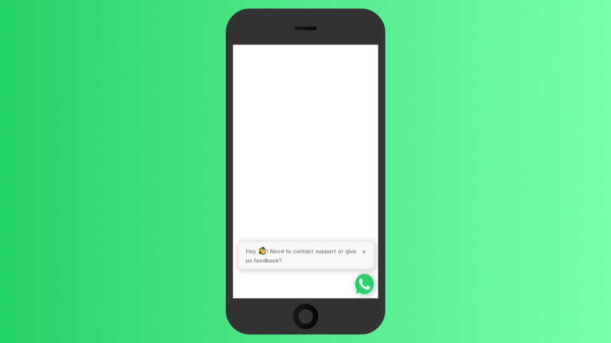

## WhatsWidget

**WhatsWidget** is a simple javascript widget that allow your customers to talk to you directly on whatsapp. It's based on [this post](https://blog.jenyay.com/building-javascript-widget/) by Jenyay so if you're interested in building javascript widgets, start there 👍.


### Features

* Free and open source!
* No watermark
* Use multiple phone numbers to talk with your customers
* Change the position of the widget
* Customize the message and when it appears

#### WIP

* Light and dark theme
* Change the green color of the WhatsApp icon to whatever you want

### Usage

Just add a **script** before your closing **head** tag. 

```javascript
(function (w,d,s,o,f,js,fjs) {
    w['ww']=o;w[o] = w[o] || function () { (w[o].q = w[o].q || []).push(arguments) }
    js = d.createElement(s), fjs = d.getElementsByTagName(s)[0]
    js.id = o; js.src = f; js.async = 1; fjs.parentNode.insertBefore(js, fjs)
}(window, document, 'script', 'whatswidget', 'https://cdn.jsdelivr.net/gh/mascarell/whatswidget/widget.js'))

whatswidget('config', {
    message: 'Widget example! 🔥',
	// You can put only one number in the array if you don't need multiple phones support
    phone: ['34123456789', '34444444444', '34666666666'],
    showMessageAlways: true,
    useCookies: true
})
```

### Configuration options

|                       | **description**                                                                                                                                          | **required** | **default** |
|-----------------------|----------------------------------------------------------------------------------------------------------------------------------------------------------|--------------|-------------|
| **message**           | Widget welcome message. If not provided, no message will be shown.                                                                                                                                          | No           |             |
| **phone**             | **Array** with the numbers you want people to contact. **Don't forget** to add the prefix of your country, for example, 34666666666 (Spain uses +34 for the prefix, don't use + or parentheses for the number). If no number is provided, the widget will not redirect on click. | No           |             |
| **floatLeft**         | Align the widget to the left. By default it's aligned to the right.                                                                                                                           | No           | false       |
| **showMessageAlways** | The message is hidden by default on mobile viewports, it is, however, responsive, so just change to true and it will show on smartphones too.            | No           | false       |
| **useCookies**        | Show the message only once per day, change to false to not use cookies and show the message everytime the user visits your site.                         | No           | false        |

### Run the project locally

```bash
git clone https://github.com/mascarell/whatswidget.git
cd whatswidget

# install dependencies
cd dev
npm install

# to test locally
npm run start
#or
npm run build

# to build for release
npm run build-release
```